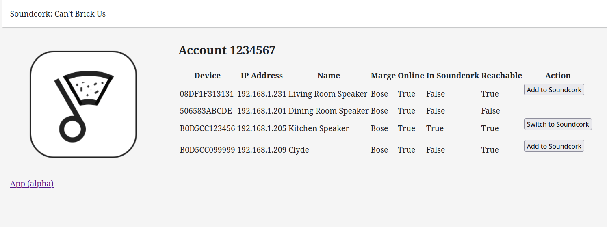

# soundcork
Intercept API for Bose SoundTouch after they turn off the servers

## Status

This project is beta. We welcome contributions! See [CONTRIBUTING.md](CONTRIBUTING.md) for more information, and the project [milestones](https://github.com/deborahgu/soundcork/milestones?sort=title&direction=asc) for our goals.

Read [SECURITY.md](SECURITY.md) carefully. This should only be run inside your home network, behind a firewall. (If you have a router at home, it probably has a firewall on it.) Don't put it on an open network.

### Service status

We'll maintain a forum post with the [Current Status of Bose Cloud Services](https://github.com/deborahgu/soundcork/discussions/181). Check there for updates. We will update whenever we learn new information.

## Background
[Bose has announced that they are shutting down the servers for the SoundTouch system in February, 2026. ](https://www.bose.com/soundtouch-end-of-life) When those servers go away, certain network-based functionality currently available to SoundTouch devices will stop working.

This is an attempt to reverse-engineer those servers so that users can continue to use the full set of SoundTouch functionality after Bose shuts the official servers down.

### Context

[As described here](https://flarn2006.blogspot.com/2014/09/hacking-bose-soundtouch-and-its-linux.html), it is possible to access the underlying server by creating a USB stick with an empty file called ```remote_services``` and then booting the SoundTouch with the USB stick plugged in to the USB port in the back. From there we can then telnet (or ssh, but the ssh server running is fairly old) over and log in as root (no password).

Once logged into the speaker, you can go to `/opt/Bose/etc` and look at the file `SoundTouchSdkPrivateCfg.xml`:

	<?xml version="1.0" encoding="utf-8"?>
	<SoundTouchSdkPrivateCfg>
	  <margeServerUrl>https://streaming.bose.com</margeServerUrl>
	  <statsServerUrl>https://events.api.bosecm.com</statsServerUrl>
	  <swUpdateUrl>https://worldwide.bose.com/updates/soundtouch</swUpdateUrl>
	  <usePandoraProductionServer>true</usePandoraProductionServer>
	  <isZeroconfEnabled>true</isZeroconfEnabled>
	  <saveMargeCustomerReport>false</saveMargeCustomerReport>
	  <bmxRegistryUrl>https://content.api.bose.io/bmx/registry/v1/services</bmxRegistryUrl>
	</SoundTouchSdkPrivateCfg>

Assumingly all four servers listed there will be shut down. From testing, the `marge` server is necessary for basic network functionality, and the `bmx` server seems to be required for TuneIn radio, custom radio streams, and SiriusXM, at least. The stats and swUpdate addresses don't seem to be necessary for the speaker to function.

## Running, testing, and installing soundcork

### Development

See the [wiki](https://github.com/deborahgu/soundcork/wiki/) for developer guidelines.

### Installing

This has been written and tested with Python 3.12. Eventually it will be bundled as an installable app but for now you'll want a virtual environment.


1. You can use `venv`, `virtualenvwrapper`, or any other tool that lets you
manage virtual environments. These docs assume `venv`.
	- Unix, Windows, and MacOS [installation and use guide for venv](https://packaging.python.org/en/latest/guides/installing-using-pip-and-virtual-environments/).
	- Your operating system might have some prerequisites here. On ubuntu, you may need:
		```sh
		sudo apt install python3-pip python3.12-venv
		```
1. Set up the virtual environment and run it. Run these commands in the
directory where you've cloned the repository. (Adapt as needed for your shell
or OS.)

	```sh
	mkdir .venv
	python3.12 -m venv .venv
	source .venv/bin/activate
	```
1. Install the pre-requisites
	```bash
	pip install -r requirements.txt
	```

When you're done with the virtual environment, you can type `deactivate` to leave that shell.

### Running

- To run in test
	```sh
	fastapi dev main.py
	# server is on http://127.0.0.1:8000
	```
- To run a prod server
	```sh
	fastapi run main.py
	```
- To run as a daemon
    - install the package in your virtualenv
		```sh
		pip install build && \
		python -m build && \
		pip install dist/*.whl
		``` 
    - If using systemd, make a copy of `soundcork.service.example`, named `soundcork.service`
	- modify the placeholder strings appropriately
	- then mv to systemd and enable.
		```sh
		sudo mv soundcork.service /etc/systemd/system && \
		sudo systemctl daemon-reload && \
		sudo systemctl enable soundcork && \
		sudo systemctl start soundcork
		```
    - To update the server, rebuild the project and restart. NOTE: In the current development stage of the project, we code changes may happen without a change of the version number. In these cases, or if you update your local code yourself, this build process has to be repeated, but with the last command modified to ```pip install dist/*.whl --force-reinstall```:
      ```
      git pull
      pip install build && \
      python -m build && \
      pip install dist/*.whl --force-reinstall
      sudo systemctl restart soundcork
      ```

You can verify the server by checking the `/docs` endpoint at your URL.

### Setting your SoundTouch device to use the soundcork server

For purposes of this example, let's say that you've set up a soundcork server on your local server available via hostname ```soundcork.local.example.com``` and running on port 8000.  Let's also say that you want a data dir at ```/home/soundcork/db```.

To configure the server, go to the ```soundcork``` subdirectory of the repository. Copy the ```env.shared``` file to ```env.private```, and then edit it to show your configuration:

	cd soundcork
	cp .env.shared .env.private
	vim .env.private
	
new contents of ```.env.private```:

	base_url = "http://soundcork.local.example.com:8000"
	data_dir = "/home/soundcork/db"

and then start the server

	fastapi run main.py

#### Optional TuneIn regional browsing

TuneIn's `Local Radio` and `Trending` browse endpoints appear to use the
requesting server's IP address when no location is provided. If your Soundcork
server resolves to the wrong region, configure the TuneIn browse query in
`.env.private`.

Examples:

	tunein_local_query = "c=local&latlon=51.23,6.77"
	tunein_trending_query = "c=trending&latlon=51.23,6.77"

You can also use TuneIn location IDs discovered via `Browse.ashx?id=r0`:

	tunein_local_query = "id=r100447"

Once a soundcork server is running, the next step is to configure your SoundTouch device to run using soundcork instead of the Bose servers.  The first step is to get access to the Bose system. As mentioned in the Context section above, the way to do that is to get a USB drive, create a file called ```remote_services```, plug it into the USB port of the SoundTouch speaker. 

### Configuring speakers using the soundcork UI

The easiest way to configure speakers is through the soundcork UI.  Navigate to your soundcork server at (in this example) `http://soundcork.local.example.com:8000/admin`. You should see a screen like


This will list all the speakers found on your local network. The "Marge" listing shows whether the speaker is currently configured to run against the main "Bose" server or are configured to run against your soundcork instance. "In Soundcork" shows if soundcork has the configuration for the speaker or not. "Reachable" indicates if the `remote_services` file has been properly read and the speaker can be accessed for update.

Under "Action" there are three possible actions available: 

- "Configure Account" is run first and both creates the associated account in soundcork and also adds the speaker configuration to soundcork. This action requires that the speaker be Reachable.
- "Add to Soundcork" may be used to add the speaker configuration to soundcork once the account has been created. 
- "Switch to Soundcork" actually configures the speaker to run using the soundcork server and then reboots the speaker. The UI will wait until the speaker has rebooted (a little over a minute usually) and then return to the admin screen. This action requires that the speaker be Reachable.


### Manual configuration of speakers

If the soundcork admin UI is not working for you, or if you just want a more hands-on experience, you can configure the speakers to run with soundcork directly.

Once the speaker has had the usb with `remote_services` installed, you can connect to it via telnet. So if your SoundTouch device is on 192.168.1.158, you can do

	telnet 192.168.1.158
	
You'll get a login screen.  Log in as user ```root```; there is no password. 
Once you're logged into the shell on the SoundTouch speaker, there are two things that need to be done. First, the speaker has a lot of information about its current configuration; this information will need to be sent to the soundcork server so that we can send it back to the speaker.  Second, the speaker will need to be configured to point to the soundcork server itself.

#### Configuring the soundcork server from the Bose speaker

The general layout of the soundcork db (using /home/soundcork/db as the db location) is

	/home/soundcork/db/{account}/Presets.xml
	/home/soundcork/db/{account}/Recents.xml
	/home/soundcork/db/{account}/Sources.xml
	/home/soundcork/db/{account}/devices/{deviceid}/DeviceInfo.xml
		
The first two things that we'll need to do is to get the speaker's device ID and account ID. Both of these are available via the webserver running on port 8090 of the SoundTouch device:

	http://192.168.1.158:8090/info

This should return something like

	<info deviceID="A0B1C2D3E4F5">
	<name>Your SoundTouch Name</name>
	<type>SoundTouch 20</type>
	<margeAccountUUID>1234567</margeAccountUUID>
	
So now your have your account number of ```1234567``` and device ID of ```A0B1C2D3E4F5```. Now, back on your soundcork system, create directories for the account and device in your ```data_dir```:

	mkdir -p /home/soundcork/db/1234567/devices/A0B1C2D3E4F5

`Presets.xml`, `Recents.xml`, and `DeviceInfo.xml` can all be gotten via the web UI at `http://{SoundTouchIp}:8090/presets`, `http://{SoundTouchIp}:8090/recents`, and `http://{SoundTouchIp}:8090/info`, respectively. Fetch those URLs and save the returned XML as the apprpriate files. (If you have multiple SoundTouch devices, create a directory and `DeviceInfo.xml` file for each one. If you have multiple accounts that you keep separate, repeat this procedure for each account.)

For Sources, there is some information that is stored on the devices themselves that isn't exposed via the web UI, so you have to go onto the device itself to get that file. `telnet` or `ssh` into the device and then transfer the `Sources.xml` file over to your soundcork db:

	cd /mnt/nv/BoseApp-Persistence/1/
	scp Sources.xml username@soundcork.local.example.com:/home/soundcork/db/1234567
	
(If you're not running an ssh server on your machine you can also copy over the files to your USB stick and transfer them that way; the stick is mounted at ```/media/sda1```.)

*Note on `Sources.xml`*: The marge server has `id`s associated with the configured sources but these values don't seem to be stored anywhere on the devices. These values should all be unique but I believe that they are arbitrary--that is, it's necessary for soundcork to have `id`s for each source, but not that the `id`s match the original marge `id`s. soundcork will assign `id`s to sources if they are not present, but it might be better at this time to go ahead and assign `id`s in the `Sources.xml` file. To do so, just add an `id` field to each `source` element like so:

	<source displayName="AUX IN" id="123456" secret="">


#### Configuring the Bose speaker to use the soundcork server

Now that the soundcork server has all of the information that it needs, we're ready to tell the speaker to use the soundcork server instead of the Bose servers.  For this, we go to the local configuration directory and copy over the default ```SoundTouchSdkPrivateCfg.xml`` as ```OverrideSdkPrivateCfg.xml```

	cd /mnt/nv
	cp /opt/Bose/etc/SoundTouchSdkPrivateCfg.xml OverrideSdkPrivateCfg.xml
	
and edit the file ```OverrideSdkPrivateCfg.xml```

	vi OverrideSdkPrivateCfg.xml
	
The original values are

	<?xml version="1.0" encoding="utf-8"?>
	<SoundTouchSdkPrivateCfg>
  	<margeServerUrl>https://streaming.bose.com</margeServerUrl>
  	<statsServerUrl>https://events.api.bosecm.com</statsServerUrl>
  	<swUpdateUrl>https://worldwide.bose.com/updates/soundtouch</swUpdateUrl>
  	<usePandoraProductionServer>true</usePandoraProductionServer>
  	<isZeroconfEnabled>true</isZeroconfEnabled>
  	<saveMargeCustomerReport>false</saveMargeCustomerReport>
  	<bmxRegistryUrl>https://content.api.bose.io/bmx/registry/v1/services</bmxRegistryUrl>
	</SoundTouchSdkPrivateCfg>>
	
set these all to point to the soundcork server

	<?xml version="1.0" encoding="utf-8"?>
	<SoundTouchSdkPrivateCfg>
  	<margeServerUrl>http://soundcork.local.example.com:8000/marge</margeServerUrl>
  	<statsServerUrl>http://soundcork.local.example.com:8000</statsServerUrl>
  	<swUpdateUrl>http://soundcork.local.example.com:8000/updates/soundtouch</swUpdateUrl>
  	<usePandoraProductionServer>true</usePandoraProductionServer>
  	<isZeroconfEnabled>true</isZeroconfEnabled>
  	<saveMargeCustomerReport>false</saveMargeCustomerReport>
  	<bmxRegistryUrl>http://soundcork.local.example.com:8000/bmx/registry/v1/services</bmxRegistryUrl>
	</SoundTouchSdkPrivateCfg>>

And finally, the moment of truth: reboot the speaker.  You can do it the way we did earlier by unplugging it, or, now that we have access to the command prompt, just run

	reboot
	

*Note* an earlier version of this documentation had you edit the ```/opt/Bose/etc/SoundTouchSdkPrivateCfg.xml``` directly. It turns out that misformatting this file can result in the speaker entering a reboot spiral that requires a firmware update to fix. Editing ```/mnt/nv/OverrideSdkPrivateCfg.xml``` is much safer. (h/t to the [Ueberbose team](https://github.com/julius-d/ueberboese-api)  for finding this.
